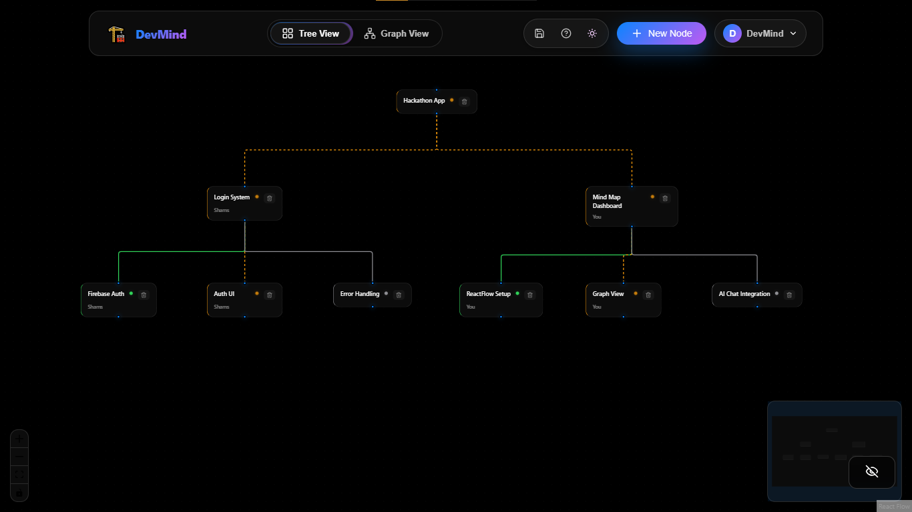
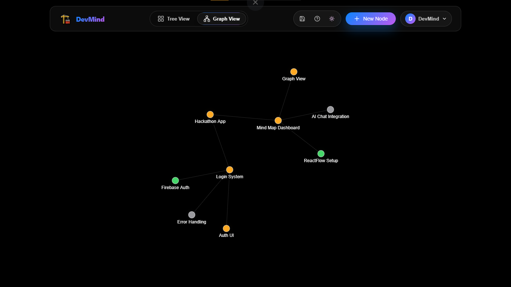
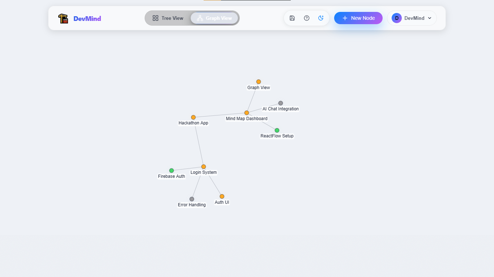
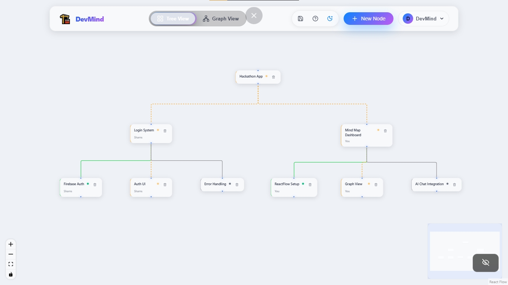
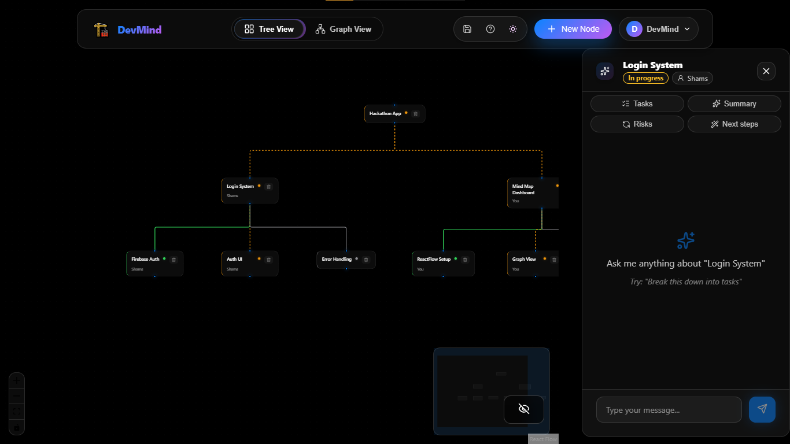
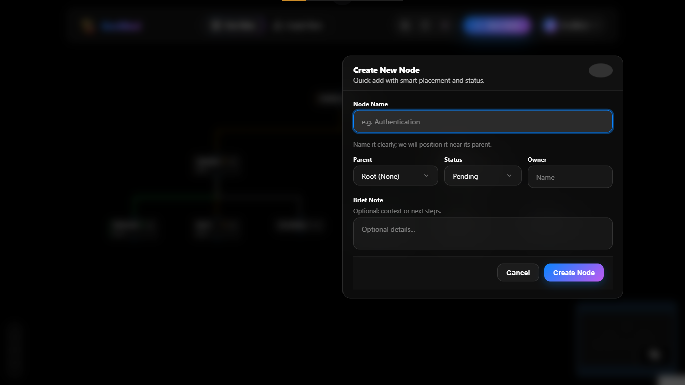
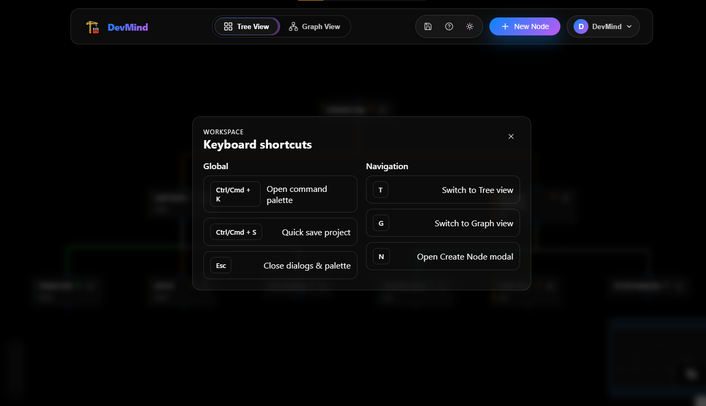

# 🧠 DevBrain - The Architect

<div align="center">


**AI-Powered Mind Mapping & Project Planning Tool**

[](https://reactjs.org/)
[](https://www.djangoproject.com/)
[](https://www.python.org/)
[](LICENSE)

[Features](#-features) • [Demo](#-demo) • [Installation](#-installation) • [Architecture](#-architecture) • [Usage](#-usage)

</div>

---

## 📖 Table of Contents

- [What is DevBrain?](#-what-is-devbrain)
- [The Problem We Solve](#-the-problem-we-solve)
- [Key Benefits](#-key-benefits)
- [Features](#-features)
- [Tech Stack](#-tech-stack)
- [Architecture](#-architecture)
- [Installation](#-installation)
- [Usage Guide](#-usage-guide)
- [API Documentation](#-api-documentation)
- [Contributing](#-contributing)
- [License](#-license)

---

## 🎯 What is DevBrain?

**DevBrain** is an intelligent mind mapping and project planning tool that combines visual thinking with AI assistance. It helps developers, teams, and students break down complex projects into manageable hierarchical structures while providing contextual AI guidance at every step.

Think of it as **Obsidian meets Notion meets ChatGPT** - all in one beautiful, glassmorphic interface.

---

## 🔥 The Problem We Solve

### Traditional Project Planning Pain Points:

❌ **Scattered Information** - Notes in one app, tasks in another, ideas in a third  
❌ **Loss of Context** - Switching between tools loses the big picture  
❌ **Manual Breakdown** - Breaking projects into tasks is time-consuming  
❌ **No AI Integration** - Generic AI tools lack project-specific context  
❌ **Poor Visualization** - Text-heavy tools don't show relationships clearly  

### How DevBrain Solves This:

✅ **Unified Workspace** - Everything in one place: ideas, tasks, hierarchy, and AI chat  
✅ **Visual Thinking** - See your entire project structure at a glance (Tree & Graph views)  
✅ **AI That Understands Context** - Chat with AI about specific nodes with knowledge base grounding  
✅ **Automatic Persistence** - All changes auto-save to database, no manual saving  
✅ **Hierarchical Organization** - Parent-child relationships make complex projects manageable  

---

## 🎬 Demo

### 🖼️ Screenshots

<div align="center">

#### Tree View (Dark Mode)

*Hierarchical project structure with parent-child relationships clearly visualized*

#### Graph View (Dark Mode)

*Interactive force-directed graph showing node connections*

#### Graph View (Light Mode)

*Clean light theme for daytime productivity*

#### Tree View (Light Mode)

*Structured view with intelligent auto-layout*

#### AI Chat Panel

*Context-aware AI assistance for each node with task breakdown and smart suggestions*

#### Create Node Modal

*Quick node creation with smart placement and status tracking*

#### Keyboard Shortcuts

*Power user features for efficient navigation and workflow*

</div>

---

## 💎 Key Benefits

| Benefit | Description |
|---------|-------------|
| 🚀 **Faster Planning** | Break down projects 3x faster with AI-assisted task decomposition |
| 🧩 **Better Organization** | Visual hierarchy shows dependencies and relationships clearly |
| 💡 **Smarter Decisions** | AI provides context-aware suggestions based on uploaded knowledge |
| 📊 **Track Progress** | Real-time status tracking (Not Started → In Progress → Completed) |
| 🔄 **Never Lose Data** | SQLite persistence ensures everything is saved automatically |
| 🎨 **Beautiful UX** | Glassmorphic design with smooth animations makes planning enjoyable |

---

## ✨ Features

### 🗺️ **Dual Visualization Modes**

<details>
<summary><strong>Tree View</strong> - Hierarchical Layout</summary>

- Dagre-based automatic positioning
- Clear parent-child relationships
- Zoom and pan controls
- Perfect for structured planning

```
Project Root
├── Frontend Development
│   ├── UI Design
│   ├── Component Library
│   └── Integration Tests
├── Backend Development
│   ├── API Design
│   ├── Database Schema
│   └── Authentication
└── DevOps
    ├── CI/CD Pipeline
    └── Monitoring Setup
```
</details>

<details>
<summary><strong>Graph View</strong> - Force-Directed Network</summary>

- Physics-based interactive layout
- Drag nodes to rearrange
- Obsidian-style knowledge graph
- Perfect for exploring connections
</details>

---

### 🤖 **AI-Powered Chat (Gemini Integration)**

- **Node-Specific Context**: Chat about individual tasks/ideas
- **Knowledge Grounding**: Upload PDFs, DOCX, TXT, MD files for AI reference
- **Persistent History**: All conversations saved per node
- **Smart Suggestions**: Get breakdowns, risk analysis, implementation steps

**Example Interactions:**
```
You: "Break this down into tasks"
AI: "Here's a task breakdown for 'Frontend Development':
     1. Set up React project with Vite
     2. Install UI libraries (React Flow, Framer Motion)
     3. Create component structure
     4. Implement state management with Zustand
     5. Build ChatPanel and NodeCard components..."

You: "What are the risks?"
AI: "Key risks for this node:
     ⚠️ Scope creep if features aren't prioritized
     ⚠️ React Flow learning curve may slow development
     ⚠️ State management complexity as app grows..."
```

---

### 📁 **Knowledge Base System**

Upload your research, documentation, and notes:
- 📄 **PDF** - Research papers, design docs(upcoming)
- 📝 **DOCX** - Word documents, specifications(upcoming)
- 📋 **TXT/MD** - Plain text notes, markdown files

The AI automatically searches and references uploaded knowledge when answering questions.

---

### 🎯 **Status Tracking & Progress**

Visual indicators for every node:
- 🔴 **Not Started** - Gray, default state
- 🟡 **In Progress** - Amber, animated edges
- 🟢 **Completed** - Green, success state

Track progress across your entire project hierarchy at a glance.

---

### ⚡ **Smart Features**

| Feature | Shortcut | Description |
|---------|----------|-------------|
| **Command Palette** | `Cmd/Ctrl + K` | Quick navigation, fuzzy search, create nodes |
| **Auto-Save** | - | Every change persists to database instantly |
| **Connection Status** | - | Real-time backend connection monitoring |
| **Cascade Delete** | - | Deleting parent removes all children |
| **Quick Prompts** | - | Pre-built AI questions for common tasks |

---

### 🎨 **UI/UX Excellence**

- **Glassmorphism Design** - iOS-inspired blur effects and transparency
- **Smooth Animations** - Framer Motion for silky transitions
- **Dark Theme** - Easy on the eyes for long coding sessions
- **Responsive Layout** - Adapts to different screen sizes
- **Keyboard Shortcuts** - Power user optimizations

---

## 🛠️ Tech Stack

### Frontend
```javascript
React 19.2          // UI Framework
Zustand             // State Management
React Flow          // Tree View & Node Editor
React Force Graph   // Graph Visualization
Framer Motion       // Animations
Dagre               // Layout Algorithm
Lucide React        // Icon Library
Vite                // Build Tool
```

### Backend
```python
Django 4.2          # Web Framework
Django REST         # API Framework
SQLite              # Database (easily upgradable to PostgreSQL)
Google Gemini API   # AI Integration
PyPDF2              # PDF Processing
python-docx         # DOCX Processing
```

### Infrastructure
- **CORS Enabled** - Seamless frontend-backend communication
- **RESTful API** - Standard HTTP/JSON endpoints
- **ORM Models** - Type-safe database queries
- **Auto Migrations** - Database schema versioning

---

## 🏗️ Architecture

### System Overview

```
┌─────────────────────────────────────────────────────────────────┐
│                      USER BROWSER                                │
│                  http://localhost:5173                           │
│                                                                   │
│  ┌────────────────────────────────────────────────────────┐    │
│  │              React Frontend (Vite)                      │    │
│  │                                                          │    │
│  │  ┌──────────┐  ┌───────────┐  ┌──────────────┐        │    │
│  │  │ Navbar   │  │ TreeView  │  │ GraphView    │        │    │
│  │  └──────────┘  └───────────┘  └──────────────┘        │    │
│  │                                                          │    │
│  │  ┌──────────────────────────────────────────┐          │    │
│  │  │  ChatPanel (AI Integration)              │          │    │
│  │  │  💬 Context-aware conversations          │          │    │
│  │  │  📚 Knowledge base grounding             │          │    │
│  │  └──────────────────────────────────────────┘          │    │
│  │                                                          │    │
│  │  ┌──────────────────────────────────────────┐          │    │
│  │  │  Zustand Store (Global State)            │          │    │
│  │  │  - nodes, edges, chatHistory             │          │    │
│  │  │  - currentView, selectedNodeId           │          │    │
│  │  └──────────────────────────────────────────┘          │    │
│  │                      ↕ HTTP/JSON                        │    │
│  │  ┌──────────────────────────────────────────┐          │    │
│  │  │  API Service (services/api.js)           │          │    │
│  │  │  - createNode(), chatWithAI()            │          │    │
│  │  │  - uploadKnowledge(), loadProject()      │          │    │
│  │  └──────────────────────────────────────────┘          │    │
│  └────────────────────────────────────────────────────────┘    │
└─────────────────────────────────────────────────────────────────┘
                           ↕ CORS Enabled
                    http://localhost:8000/api
┌─────────────────────────────────────────────────────────────────┐
│                    Django Backend Server                         │
│                                                                   │
│  ┌────────────────────────────────────────────────────────┐    │
│  │              URL Router (config/urls.py)               │    │
│  │  /api/projects/         → ProjectViewSet              │    │
│  │  /api/nodes/            → NodeViewSet                  │    │
│  │  /api/edges/            → EdgeViewSet                  │    │
│  │  /api/knowledge/        → KnowledgeBaseViewSet        │    │
│  │  /api/chat/node/{id}/   → ChatNodeView                │    │
│  └────────────────────────────────────────────────────────┘    │
│                           ↕                                      │
│  ┌────────────────────────────────────────────────────────┐    │
│  │         Business Logic (api/services.py)               │    │
│  │                                                          │    │
│  │  ┌──────────────────┐  ┌──────────────────────┐       │    │
│  │  │ GeminiAIService  │  │ KnowledgeSearchService│       │    │
│  │  │ - Build context  │  │ - Keyword matching    │       │    │
│  │  │ - Call API       │  │ - Score results       │       │    │
│  │  │ - Save messages  │  │ - Return top K        │       │    │
│  │  └──────────────────┘  └──────────────────────┘       │    │
│  └────────────────────────────────────────────────────────┘    │
│                           ↕                                      │
│  ┌────────────────────────────────────────────────────────┐    │
│  │         Django ORM Models (api/models.py)              │    │
│  │                                                          │    │
│  │  ┌─────────┐  ┌──────┐  ┌──────┐  ┌───────────────┐  │    │
│  │  │ Project │  │ Node │  │ Edge │  │ KnowledgeBase │  │    │
│  │  └─────────┘  └──────┘  └──────┘  └───────────────┘  │    │
│  │       │            │         │             │            │    │
│  └────────────────────────────────────────────────────────┘    │
│           │            │         │             │                │
│           └────────────┴─────────┴─────────────┘                │
│                         ↕                                        │
│  ┌────────────────────────────────────────────────────────┐    │
│  │              SQLite Database                            │    │
│  │  db.sqlite3 (easily upgradable to PostgreSQL)         │    │
│  └────────────────────────────────────────────────────────┘    │
└─────────────────────────────────────────────────────────────────┘
                           ↕
                  Google Gemini API
                  (AI Responses)
```

---

### Data Model (Entity Relationship)

```
┌──────────────────────┐
│      Project         │
│ ─────────────────── │
│ + id: UUID           │
│ + name: String       │
│ + description: Text  │
│ + owner: ForeignKey  │
│ + created_at         │
└──────────────────────┘
          │ 1
          │
          │ has many
          ↓ *
┌──────────────────────┐        ┌──────────────────────┐
│       Node           │ *    * │       Edge           │
│ ─────────────────── │←──────→│ ─────────────────── │
│ + id: UUID           │        │ + id: UUID           │
│ + label: String      │        │ + source: FK(Node)   │
│ + description: Text  │        │ + target: FK(Node)   │
│ + status: Choice     │        │ + project: FK        │
│ + parent: FK(self)   │        └──────────────────────┘
│ + position_x: Float  │
│ + position_y: Float  │
└──────────────────────┘
          │ 1
          │
          │ has many
          ↓ *
┌──────────────────────┐
│    ChatMessage       │
│ ─────────────────── │
│ + id: UUID           │
│ + node: FK(Node)     │
│ + role: Choice       │      (user/assistant)
│ + content: Text      │
│ + metadata: JSON     │      (knowledge sources)
│ + timestamp          │
└──────────────────────┘

┌──────────────────────┐
│   KnowledgeBase      │
│ ─────────────────── │
│ + id: UUID           │
│ + project: FK        │
│ + title: String      │
│ + file_type: Choice  │      (pdf/docx/txt/md)
│ + content_preview    │
│ + full_text: Text    │
│ + uploaded_at        │
└──────────────────────┘
```

---

### API Flow Diagram

```
Frontend Action → API Call → Backend Processing → Database → Response
──────────────────────────────────────────────────────────────────────

📌 CREATE NODE:
   User clicks "New Node" 
   → POST /api/nodes/
   → NodeViewSet.create()
   → Save to DB
   → Return node JSON
   → Update Zustand store
   → UI rerenders

💬 CHAT WITH AI:
   User sends message
   → POST /api/chat/node/{id}/
   → GeminiAIService.generate_response()
   → KnowledgeSearchService.search_relevant_knowledge()
   → Build context prompt
   → Call Gemini API
   → Save message to DB
   → Return AI response
   → Update chat history
   → UI displays message

📂 UPLOAD KNOWLEDGE:
   User uploads PDF
   → POST /api/knowledge/
   → KnowledgeBaseViewSet.create()
   → Extract text (PyPDF2)
   → Save to DB with full_text
   → Return knowledge base entry
   → Available for AI context
```

---

## 🚀 Installation

### Prerequisites

- **Node.js** 18+ and npm
- **Python** 3.9+
- **Git**

### 1️⃣ Clone the Repository

```bash
git clone https://github.com/shams909/devbrain-the-architect.git
cd devbrain-the-architect
```

### 2️⃣ Backend Setup

```bash
cd backend/backend

# Create virtual environment
python -m venv venv

# Activate virtual environment
# Windows:
venv\Scripts\activate
# Mac/Linux:
source venv/bin/activate

# Install dependencies
pip install -r requirements.txt

# Run migrations
python manage.py makemigrations
python manage.py migrate

# Create superuser (optional, for admin panel)
python manage.py createsuperuser

# Start Django server
python manage.py runserver
```

Backend runs at: **http://localhost:8000**

### 3️⃣ Frontend Setup

```bash
# Open new terminal
cd frontend

# Install dependencies
npm install

# Start Vite dev server
npm run dev
```

Frontend runs at: **http://localhost:5173**

### 4️⃣ Configure Gemini API (Optional)

Get your API key from [Google AI Studio](https://makersuite.google.com/app/apikey)

Edit `backend/backend/config/settings.py`:

```python
GEMINI_API_KEY = "your-api-key-here"  # Replace with your actual key
GEMINI_MODEL = "gemini-pro"
```

**Note:** Without API key, the system uses intelligent fallback responses.

---

## 📚 Usage Guide

### Creating Your First Mind Map

1. **Start Both Servers**
   - Backend: `python manage.py runserver`
   - Frontend: `npm run dev`

2. **Open the App**
   - Navigate to `http://localhost:5173`
   - App auto-creates a project on first load

3. **Create a Root Node**
   - Click "New Node" button
   - Fill in details:
     - **Label:** "My Project"
     - **Description:** "Main project overview"
     - **Status:** Not Started
     - **Parent:** None (this makes it a root node)
   - Click "Create"

4. **Add Child Nodes**
   - Click "New Node" again
   - Fill in details:
     - **Label:** "Frontend Development"
     - **Parent:** Select "My Project"
   - Repeat for more children

5. **Chat with AI**
   - Click on any node
   - Chat panel opens on right
   - Try: "Break this down into tasks"
   - AI responds with context-aware suggestions

6. **Upload Knowledge**
   - Upload PDFs, docs, notes
   - AI will reference them in responses
   - Shows "📚 Using knowledge: [filename]" in chat

7. **Switch Views**
   - Click Tree/Graph toggle in navbar
   - Or press `Cmd/Ctrl + K` → "Switch to Graph View"

8. **Track Progress**
   - Edit nodes to update status
   - Watch visual indicators change
   - See progress across entire hierarchy

---

### Keyboard Shortcuts

| Shortcut | Action |
|----------|--------|
| `Cmd/Ctrl + K` | Open command palette |
| `Escape` | Close modals/panels |
| `Enter` | Send chat message |
| Click node | Open chat panel |

---

## 🔌 API Documentation

### Base URL
```
http://localhost:8000/api
```

### Endpoints

#### **Projects**

```http
GET    /api/projects/          # List all projects
POST   /api/projects/          # Create project
GET    /api/projects/{id}/     # Get project details
PATCH  /api/projects/{id}/     # Update project
DELETE /api/projects/{id}/     # Delete project
```

**Example Request:**
```json
POST /api/projects/
{
  "name": "My Hackathon Project",
  "description": "AI-powered task manager"
}
```

#### **Nodes**

```http
GET    /api/nodes/                # List all nodes
POST   /api/nodes/                # Create node
GET    /api/nodes/{id}/           # Get node details
PATCH  /api/nodes/{id}/           # Update node
DELETE /api/nodes/{id}/           # Delete node (cascade)
GET    /api/nodes/?project={id}   # Filter by project
```

**Example Request:**
```json
POST /api/nodes/
{
  "project": "project-uuid",
  "label": "Build API",
  "description": "RESTful API with Django",
  "status": "in-progress",
  "parent": "parent-node-uuid",
  "position_x": 100,
  "position_y": 200
}
```

#### **Chat**

```http
POST /api/chat/node/{id}/   # Send message to AI
```

**Example Request:**
```json
POST /api/chat/node/node-uuid/
{
  "message": "Break this down into tasks",
  "use_knowledge": true
}
```

**Example Response:**
```json
{
  "response": "Here's a task breakdown:\n1. Set up Django\n2. Create models...",
  "metadata": {
    "knowledge_sources": ["project-plan.pdf", "api-spec.md"],
    "model": "gemini-pro"
  }
}
```

#### **Knowledge Base**

```http
GET    /api/knowledge/              # List all knowledge
POST   /api/knowledge/              # Upload file
DELETE /api/knowledge/{id}/         # Delete knowledge
GET    /api/knowledge/?project={id} # Filter by project
```

**Example Request (multipart/form-data):**
```http
POST /api/knowledge/
Content-Type: multipart/form-data

project: project-uuid
file: [binary file data]
```

---

## 🎯 Real-World Use Cases

### 1. **Hackathon Planning**

```
🏆 Hackathon Project
├── 👥 Team Formation (Completed)
├── 💡 Idea Brainstorming (In Progress)
│   ├── Problem Research
│   └── Solution Design
├── 💻 Development (Not Started)
│   ├── Frontend (React + Vite)
│   ├── Backend (Django API)
│   └── Integration Testing
├── 🎨 Design & UX
└── 📊 Presentation Prep
```

**AI Chat Example:**
> **You:** "What should I prioritize for a 48-hour hackathon?"  
> **AI:** "Focus on these priorities: 1) MVP features only (80% of effort), 2) Working demo over perfection, 3) Presentation story (20% of time). Skip: complex auth, scalability optimizations."

---

### 2. **Software Project Breakdown**

```
📱 Mobile App Development
├── 🎨 UI/UX Design
│   ├── Wireframes
│   ├── Mockups
│   └── User Flow
├── ⚙️ Backend Development
│   ├── Database Schema
│   ├── REST API
│   └── Authentication
├── 📱 Mobile App (upcoming)
│   ├── Login Screen
│   ├── Home Feed
│   └── Profile Page
└── 🚀 Deployment
    ├── CI/CD Pipeline
    └── App Store Submission
```

---

### 3. **Research Project Organization**

```
📚 Research Paper: AI Ethics
├── 📖 Literature Review (In Progress)
│   ├── Data Privacy Papers
│   ├── Bias in AI Studies
│   └── Regulation Frameworks
├── 🔬 Methodology
│   ├── Survey Design
│   └── Interview Protocol
├── 📊 Data Analysis
└── ✍️ Writing
    ├── Introduction
    ├── Results Section
    └── Conclusion
```

**Knowledge Base:**
- Upload 20+ research papers (PDFs)
- AI references them when discussing literature review
- Get citation suggestions: "What papers support this claim?"

---


## 🌟 Why Choose DevBrain?

### vs. Traditional Mind Maps (XMind, MindMeister)
✅ **AI Integration** - Get smart suggestions, not just visual organization  
✅ **Code-Friendly** - Built for developers, with keyboard shortcuts and dark theme  
✅ **Knowledge Base** - Upload context files for grounded AI responses  

### vs. Project Management Tools (Jira, Trello)
✅ **Visual Thinking** - See the big picture with graph/tree views  
✅ **Faster Setup** - No complex workflows, just ideas → hierarchy → tasks  
✅ **AI Assistance** - Break down epics/stories automatically  

### vs. Generic AI Chatbots (ChatGPT)
✅ **Project Context** - AI knows your entire project structure  
✅ **Node-Specific** - Conversations tied to individual tasks/ideas  
✅ **Persistent History** - All chats saved and searchable  

---

## 🛣️ Roadmap

### 🚧 In Progress
- [ ] Collaborative editing (multiple users)
- [ ] Export to Markdown/JSON
- [ ] Custom themes and color schemes

### 💡 Planned Features
- [ ] Real-time sync with WebSockets
- [ ] Mobile app (React Native)
- [ ] Integration with GitHub/Jira
- [ ] Voice input for chat
- [ ] Gantt chart view
- [ ] Time tracking per node
- [ ] AI-generated diagrams from nodes
- [ ] Support PDF, research papers and different types of files

---

## 🤝 Contributing

We welcome contributions! Here's how you can help:

### Ways to Contribute

1. **🐛 Report Bugs**
   - Open an issue with reproduction steps
   - Include screenshots if applicable

2. **💡 Suggest Features**
   - Describe the use case
   - Explain how it improves the workflow

3. **📝 Improve Documentation**
   - Fix typos, clarify instructions
   - Add examples or tutorials

4. **💻 Submit Code**
   - Fork the repo
   - Create a feature branch
   - Submit a pull request

### Development Setup

```bash
# Fork and clone your fork
git clone https://github.com/YOUR-USERNAME/devbrain-the-architect.git
cd devbrain-the-architect

# Create feature branch
git checkout -b feature/amazing-feature

# Make changes and commit
git commit -m "Add amazing feature"

# Push to your fork
git push origin feature/amazing-feature

# Open Pull Request on GitHub
```

### Code Style

- **Frontend:** Use ESLint config (already set up)
- **Backend:** Follow PEP 8 (Python style guide)
- **Commits:** Use conventional commits (`feat:`, `fix:`, `docs:`)

---

## 📄 License

This project is licensed under the **MIT License**.

```
MIT License

Copyright (c) 2026 DevBrain Team

Permission is hereby granted, free of charge, to any person obtaining a copy
of this software and associated documentation files (the "Software"), to deal
in the Software without restriction, including without limitation the rights
to use, copy, modify, merge, publish, distribute, sublicense, and/or sell
copies of the Software, and to permit persons to whom the Software is
furnished to do so, subject to the following conditions:

The above copyright notice and this permission notice shall be included in all
copies or substantial portions of the Software.

THE SOFTWARE IS PROVIDED "AS IS", WITHOUT WARRANTY OF ANY KIND, EXPRESS OR
IMPLIED, INCLUDING BUT NOT LIMITED TO THE WARRANTIES OF MERCHANTABILITY,
FITNESS FOR A PARTICULAR PURPOSE AND NONINFRINGEMENT. IN NO EVENT SHALL THE
AUTHORS OR COPYRIGHT HOLDERS BE LIABLE FOR ANY CLAIM, DAMAGES OR OTHER
LIABILITY, WHETHER IN AN ACTION OF CONTRACT, TORT OR OTHERWISE, ARISING FROM,
OUT OF OR IN CONNECTION WITH THE SOFTWARE OR THE USE OR OTHER DEALINGS IN THE
SOFTWARE.
```

---

## 🙏 Acknowledgments

- **React Flow** - Powerful node-based UI library
- **Google Gemini** - AI model for contextual responses
- **Django** - Robust Python web framework
- **Framer Motion** - Beautiful animations library
- **Zustand** - Simple state management

---

## 📞 Support & Contact

- **Email:** md.shamsuddoha109@gmail.com (placeholder)
- **Discord:** shams063

---

## 🎨 Screenshots

### Tree View - Hierarchical Mind Map
```
Visual hierarchy with parent-child connections, status indicators,
and smooth zoom/pan controls
```

### Graph View - Force-Directed Network
```
Interactive network graph with physics simulation,
drag-and-drop nodes, and relationship visualization
```

### AI Chat Panel
```
Context-aware conversations with knowledge base integration,
quick prompts, and persistent chat history
```

### Command Palette
```
Quick navigation and fuzzy search for power users,
keyboard-first workflow
```

---

<div align="center">

**Thanks to my team members time and effort. I appreciate you all guys.🖤**

**Star ⭐ this repo if you find it helpful!**

[⬆ Back to Top](#-devbrain---the-architect)

</div>
